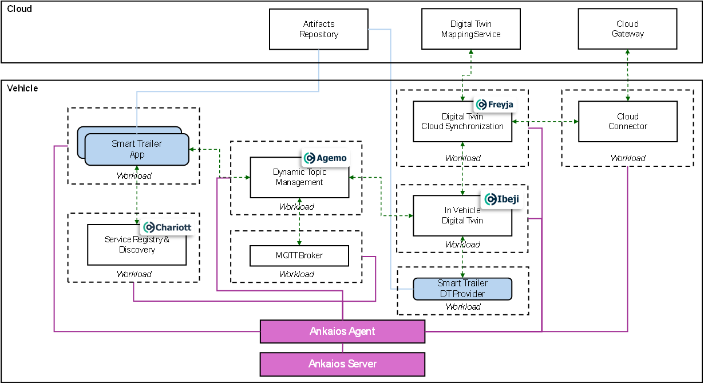

# Maestro Challenge 🚗💻🎶
- [Introduction](#introduction)
- [About](#about)
    - [In-Vehicle Software Stack Orchestrated by Ankaios](#in-vehicle-software-stack-orchestrated-by-ankaios)
    - [In-Vehicle Software Stack Orchestrated by BlueChi](#in-vehicle-software-stack-orchestrated-by-bluechi)
- [Sample Scenarios](#sample-scenarios)
    - [Core Sample Scenario](#core-sample-scenario)
    - [Other Sample Scenarios](#other-sample-scenarios)
    - [Useful References for Creating and Enhancing Sample Scenarios](#useful-references-for-creating-and-enhancing-sample-scenarios)
- [Projects Involved](#projects-involved)
    - [In-Vehicle Software Stack](#in-vehicle-software-stack)
    - [In-Vehicle Software Orchestrators](#in-vehicle-software-orchestrators)
- [Hack Coaches](#hack-coaches)

## Introduction

>Photo by <a href="https://unsplash.com/@gwundrig?utm_content=creditCopyText&utm_medium=referral&utm_source=unsplash">Manuel Nägeli</a>.

Do you want to be the next maestro of the next generation of vehicle software? The time is now!

Imagine yourself as the **maestro**. You are not just writing code. You are composing a masterpiece that will drive the future of transportation. Your work will ensure that every component, from the engine control unit to the infotainment system, works in perfect harmony. So, step up to the podium, take a deep breath, and let your creativity flow. The stage is set for you to become the maestro of in-vehicle software 🚗💻🎶.

Come hack with us!

## About

We supply an in-vehicle stack with software orchestrators. Your assignment is to utilize our in-vehicle stack and software orchestrators to construct your own scenario or replicate the scenarios provided in our [Sample Scenarios](#sample-scenarios).

The tech stack in this challenge showcases complex in-vehicle services and workloads, utilizing the vehicle’s computing resources and capabilities, as well as other in-vehicle applications.

Enjoy the process of bringing your vision to life!

### In-Vehicle Software Stack Orchestrated by Ankaios

### In-Vehicle Software Stack Orchestrated by BlueChi

The in-vehicle stack comprises Eclipse Ibeji, Eclipse Agemo, Eclipse Freyja, and Eclipse Chariott. This stack enables a universal vehicle model to be used across different vehicles, dynamic management of vehicle signal topics for publishing and subscribing, synchronization and conversion of in-vehicle signals to a cloud-based digital twin, and the development of applications without the need for specific knowledge about the location of the resources they use.

We provide two software orchestrators, Ankaios and BlueChi, to orchestrate the in-vehicle stack. Feel free to choose either for this hackathon challenge.

Please explore the [Projects Involved](#projects-involved) section for a deeper dive into the projects that are part of this challenge.

## Sample Scenarios

Here is a list of potential scenarios your team could develop. Feel free to invent your own scenarios too. Let your creativity shine ☀️ and have fun!

Please note that it is not necessary to use both orchestrators. You can choose either one to implement your scenario.

### Provided Sample Scenario

Scenario description:
- The system detects that a smart trailer is being connected to a car. A signal is raised to the orchestrator indicating that a smart trailer provider is connected, and applications are required to manage the smart trailer and adjust the body functions and powertrain accordingly to ensure a smooth trip.

The diagrams above ([Ankaios](#ankaios) and [BlueChi](#bluechi)) depict this provided sample scenario.

We provide the code for this scenario. Please refer to {TODO: INSERT_REFERENCE} for instructions on running this scenario. **Your task is to develop a Smart Trailer Application** using the vehicle signals emitted from our Smart Trailer Digital Twin provider.

TODO: Provide some ideas to help the user build this Smart Trailer application. Also maybe provide some additional challenges, such as mentioning what you can do when the signals are synced to the cloud. For instance, create a web UI that displays the signals.

### Other Sample Scenarios
- Leverage OpenAI to enhance the vehicle’s user experience. You could develop an application that uses OpenAI’s GPT model to power an in-vehicle virtual assistant.

- Consider using OpenAI to enhance our software orchestrators, effectively creating intelligent orchestrators! OpenAI could optimize workload placements across compute nodes and/or cloud based on factors such compute usage, memory usage, network coverage, and latency.

- Create a web user interface application, such as a dashboard, that displays the various workloads' health.

### Useful References for Creating and Enhancing Sample Scenarios

This section offers guidance for creating a new sample scenario or improving the [Provided Sample Scenario](#provided-sample-scenario). While it does not provide a comprehensive list of resources, it aims to steer you in the right direction. If this section does not provide the guidance you need, please refer to the respective project’s documentation. See [Projects Involved](#projects-involved) for the project links.

TODO: This section needs to be refined. The goal is to include key references to help users easily identify the doucmentation they need to enhance a scenario or create their scenario. If this section gets too long, we can place the contents in another document and reference it here.

TODO - Some example references that may need to be included:
- Ibeji:
    - Reference the tutorial on how to write DTDL and create a vehicle model?
        - DTDL is just a reference representation of a vehicle hardware, and DTDL is not explicility parsed by anything
    - Reference the tutorial on creating DT provider
        - This tutorial would cover adding new signals to a DT provider
        - Include instructions on how to use managed subscribe, but through the Ibeji module. Users will not need to know that they are contacting Agemo.
    - Reference the tutorial on consuming signals from Ibeji
    - Freyja - Mappings config: Need to mention that "after adding a new signal to your DT provider, modify the mapping config to map the DT provider’s signal with the Cloud."
- Chariott:
    - How to use service discovery to register and discover applications
    - How to find any of our services
        Example: Ibeji's endpoint can be found through service discovery.
- Freyja - Syncing signals to the cloud:
    - If a user wishes to integrate their scenario with Azure, which image would I need to pull to enable Freyja to sync to the cloud?

## Need to know
- Basic knowledge about containerization technologies and tools (e.g. Docker, Podman)
- Basic skills to deal with distributed systems

## Projects Involved

### In-Vehicle Software Stack
- [Eclipse Agemo](https://github.com/eclipse-chariott/Agemo): Agemo incorporates a Pub Sub Service, a [gRPC](https://grpc.io/docs/what-is-grpc/introduction/) service that facilitates publish/subscribe operations for in-vehicle applications, including but not limited to Eclipse Ibeji and Eclipse Chariott. This service has the capability to register with Chariott, enhancing its discoverability by other applications such as Eclipse Ibeji. It offers dynamic creation and management of topics.

- [Eclipse Chariott](https://github.com/eclipse-chariott/chariott): Chariott operates as a [gRPC](https://grpc.io/docs/what-is-grpc/introduction/) service, offering a unified interface for application interaction. Chariott enables [Service Discovery](https://github.com/eclipse-chariott/chariott/blob/main/service_discovery/README.md), allowing provider applications to promote their capabilities by registering with Chariott’s service registry. Consumer applications in need of specific resources and capabilities can discover them via Chariott’s service registry.

- [Eclipse Freyja](https://github.com/eclipse-ibeji/freyja/): Freyja enables seamless synchronization between the vehicle’s digital twin and its cloud-based digital twin. This synchronization allows for a consistent and unified digital representation of the vehicle across both platforms.

- [Eclipse Ibeji](https://github.com/eclipse-ibeji/ibeji): Ibeji is designed with the goal of enabling a digital depiction of the vehicle’s state and capabilities. It achieves this through an adaptable, open, and dynamic architecture that provides access to the vehicle’s hardware, sensors, and capabilities. This extensible framework allows for a comprehensive and accurate representation of the vehicle’s current status and potential functionalities.

### In-Vehicle Software Orchestrators
- [Eclipse Ankaios](https://eclipse-ankaios.github.io/ankaios): Ankaios provides workload and container orchestration for automotive High Performance Computing (HPC) software . While it can be used for various fields of applications, it is developed from scratch for automotive use cases and provides a slim yet powerful solution to manage containerized applications. It supports various container runtimes with Podman as the first one, but other container runtimes and even native applications can be supported. Eclipse Ankaios is independent of existing communication frameworks like SOME/IP, DDS, or REST API.

- [Eclipse BlueChi](https://github.com/containers/bluechi): BlueChi is a systemd service controller intended for multi-node environments with a predefined number of nodes and with a focus on highly regulated ecosystems such as those requiring functional safety. Potential use cases can be found in domains such as transportation, where services need to be controlled across different edge devices and where traditional orchestration tools are not compliant with regulatory requirements.

## Hack Coaches
who can be contacted for this challenge for questions etc. (Slack-handle)

- Eclipse Agemo, Chariott, Ibeji and Freyja: Jordan Chiu (Slack handle: @Jordan Chiu)
- Eclipse Agemo, Chariott, Ibeji and Freyja: Filipe Prezado (Slack handle: @fprezado)
- Eclipse Ankaios: Chatree Akasarn (Slack handle: @Chatree Akasarn)
- Eclipse Ankaios: Oliver Klapper (Slack handle: @Oliver Klapper)
- Eclipse BlueChi: Leonardo Rossetti (Slack handle: @Leonardo Rossetti)

## All Necessary Links
