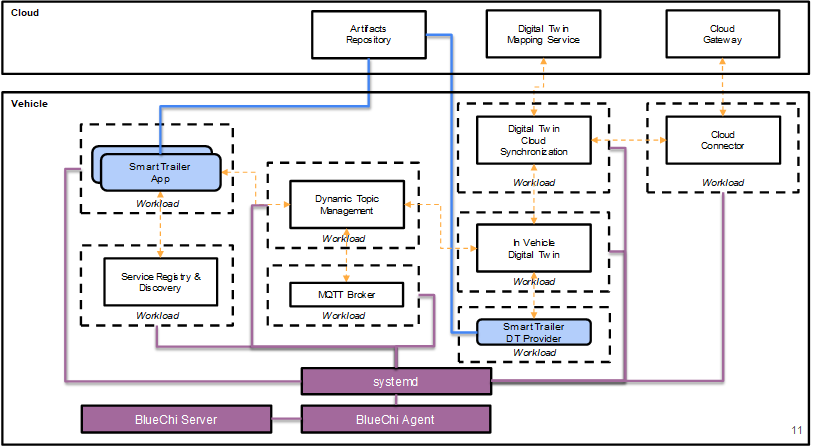

# Eclipse BlueChi



Upstream documentation: <https://bluechi.readthedocs.io/en/latest/>

BlueChi is a systemd controller that adds a thin layer to enable multi-node
workload management and cross-node dependencies.

It can handle various workloads such as containers, virtual machines or
applications running on bare metal. To run containers under systemd in an
optimal way it uses Podman's Quadlet implementation. This also enables the usage
of Kubernetes resource definitions to define the workload.

## Links

* [BlueChi documentation](https://bluechi.readthedocs.io/en/latest/)
* [BlueChi CLI
  documentation](<https://github.com/eclipse-bluechi/bluechi/blob/main/doc/man/bluechictl.1.md>)
* [Podman](https://docs.podman.io/en/latest/)
* [Podman and Quadlet](https://www.redhat.com/sysadmin/quadlet-podman)

## Development Environment

The development environment provides the following components:

* Eclipse Chariott
* Eclipse Agemo
* Eclipse Ibeji
* Eclipse Freyja
* Eclipse BlueChi
* systemd
* Podman
* Quadlet

All services are accessible via `localhost:$port`.

### Flavors

#### devcontainer

Upstream documentation: <https://containers.dev/>

You can use devcotainers to start your containerized development environment by
using the following `devcontainer.json` file. Replace "{PATH-TO-MAESTRO}" with your path to the maestro repository:

```json
{
    "name": "autosd",
    "privileged": true,
    "image": "sdvblueprint.azurecr.io/sdvblueprint/eclipse-bluechi/devenv:latest",
    "overrideCommand": false,
    "mounts": [
        "source={PATH-TO-MAESTRO}/maestro-challenge/in-vehicle-stack,target=/workspaces/devcontainer/in-vehicle-stack,type=bind"
       ]
}
```

#### Containers

Upstream documentation: <https://docs.podman.io/en/latest/>

Start the container by running:

```sh
podman run \
--rm \
--name autosd-eclipse \
--privileged \
quay.io/centos-sig-automotive/autosd-eclipse:latest
```

Enter into the container and interact with BlueChi:

```sh
podman exec -it autosd-eclipse /bin/bash
bluechictl list-units
```

### Bootstrapping

You need to bootstrap all eclipse services once you got your eclipse-bluechi container running.

You will need to login to Azure's container registry to pull all required images:

```sh
podman login \
--username  <username> \
--password  <password> \
sdvblueprint.azurecr.io
```

Then it is time to start all services which can be done by executing the bootstrap script:

```sh
$ bluechi-env-bootstrap
```

The above command will pull all the required images and start all services.

There is also a script to stop all services:

```
bluechi-env-cleanup
```

Keep in mind that stopping services will purge all the containers that are related to such services as well.

Both scripts are located in `/usr/local/bin/` in case you are interested in checking them out.

### Managing Workloads

This section describes how to deploy and perform adminstratives tasks using
systemd and BlueChi.

#### Deploying Applications

BlueChi relies on three components to handle containerized applications:

* systemd
* Quadlet
* Podman

Application definitions are stored in `/etc/containers/systemd`. An application
needs two essential files:

* `service.kube`: Used by systemd to point to a Kubernetes resource definition
  containing the workload definition.
* `service.yaml`: A Kubernetes resource definition (either `v1.Pod` or
  `apps/v1.Deployment`) that describes the workload.

Changing or updating a file in `/etc/containers/systemd` requires a `systemctl
daemon-reload` afterwards to generate the corresponding systemd unit files in
`/run/systemd/generator`.

#### Service Lifecycle

Services can be managed by using `systemctl`, systemd's administrative CLI.

Starting, stopping, restarting services is as easy as:

* `systemctl stop $svc`
* `systemc start $svc`
* `systemctl restart $svc`

> Make sure to run `systemctl daemon-reload` in case something changed in either Quadlet or systemd unit files.

#### Monitoring and Logs

BlueChi's CLI (`bluechictl`), can be used to retrieve information from
managed nodes:
<https://github.com/eclipse-bluechi/bluechi/blob/main/doc/man/bluechictl.1.md>.

##### Using Systemctl

Simply run `systemctl status $service` ($service being the name of your .kube file).

##### Using journalctl

This is valid for any systemd defined service, simply run `journalctl -xeu $service`

##### Podman

You can also list all active containers by running `podman ps` and then `podman logs $container_name_or_id` to
get logs from the container using podman.

### Running the Smart Trailer Example with BlueChi's devcontainer
Inside of the [devcontainer](#devcontainer):
1. Follow the instructions in [Bootstrapping](#bootstrapping) to start up the in-vehicle stack.
1. Run the script `start_trailer_applications_bluechi.sh` to monitor for the trailer to be connected. It can be found at `in-vehicle-stack/scenarios/smart_trailer_use_case/scripts/start_trailer_applications_bluechi.sh`.
1. In another terminal window inside the devcontainer, start the `trailer-connected` service to simulate the trailer being connected.
1. Verify the output in the terminal window of the `start_trailer_applications_bluechi.sh` script. You should see that two more services were started in response to the trailer being connected.
1. Use [Monitoring and Logs](#monitoring-and-logs) to check that the `smart-trailer` service is now receiving the value of the trailer weight every 10 seconds.
1. When you are ready to clean up, use the cleanup script mentioned in [Bootstrapping](#bootstrapping).
